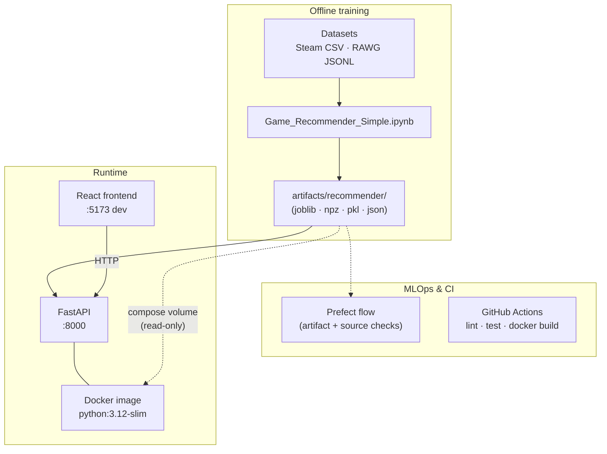

<div align="center">

# GameRec

### Hybrid game recommender · MLOps-ready stack

[](https://www.python.org/)
[](https://fastapi.tiangolo.com/)
[](https://react.dev/)
[](https://www.docker.com/)
[](https://www.prefect.io/)
[](LICENSE)

<br/>

**Course project (AI221)** — end-to-end ML pipeline from notebooks to a containerized API and cinematic React UI, with CI, artifact validation, and an IEEE LaTeX report skeleton.

<br/>

[Features](#-features) · [Architecture](#-architecture) · [Quick start](#-quick-start) · [Docker](#-docker) · [API](#-api-reference) · [Project layout](#-project-layout)

</div>

---

## Features

| Area | What you get |
|------|----------------|
| **Training** | `Game_Recommender_Simple.ipynb` — hybrid recommender, popularity regressor, archetype classifier, optional clustering & seasonality; persists **`artifacts/recommender/`**. |
| **API** | **`app/`** — FastAPI loads serialized models at startup; OpenAPI docs at **`/docs`**. |
| **UI** | **`frontend/`** — RAWG-inspired React + Vite app: discover, search, detail views, explainability, archetypes, preference-based recs. |
| **Quality gates** | **Ruff** + **pytest** + smoke **Docker build** on every push/PR (see `.github/workflows/ci.yml`). |
| **Orchestration** | **`pipelines/`** — Prefect flow checks dataset paths + artifact bundle before deploy. |
| **Docs** | **`report/`** — IEEE two-column LaTeX (`main.tex`). |

---

## Architecture

High-level data flow: **offline notebook → artifact bundle → validation → FastAPI (+ optional React)**.



---

## Quick start

### Prerequisites

- **Python 3.11–3.13** (see [`pyproject.toml`](pyproject.toml); **avoid 3.14** on Windows — NumPy/scipy wheels can crash on import).
- **Node.js 18+** for the frontend.
- **Docker Desktop** (optional) for container workflows.

### Backend API

```bash
python -m venv .venv

# Windows (PowerShell)
.\.venv\Scripts\Activate.ps1

# macOS / Linux
source .venv/bin/activate

pip install -r requirements-dev.txt

# Point at real notebook outputs (default layout: ./artifacts/recommender)
export GAMEREC_ARTIFACTS_DIR=./artifacts/recommender   # Unix
# set GAMEREC_ARTIFACTS_DIR=artifacts\recommender     # Windows CMD

uvicorn app.main:app --reload --host 0.0.0.0 --port 8000
```

Open **[http://127.0.0.1:8000/docs](http://127.0.0.1:8000/docs)** for Swagger UI.

Or use Make (requires `make` available):

```bash
make install && make api
```

### Frontend

```bash
cd frontend
npm install
npm run dev
```

Open **[http://127.0.0.1:5173](http://127.0.0.1:5173)**.

Optional **`frontend/.env.local`**:

```bash
VITE_API_BASE_URL=http://127.0.0.1:8000
```

### UI highlights

- Discover hero + trend-style clusters  
- Search/browse with skeletons and responsive cards  
- Game detail + recommendation rail + explainability  
- Player archetype badges via **`/predict/player-type/by-title`**  
- Cold-start preference recommendations via **`/recommend/user`**  
- Graceful image fallbacks using catalog metadata  

---

## Docker

Build context must be the **repository root** (includes `app/` and `requirements.txt`):

```bash
docker build -f docker/Dockerfile -t gamerec-api:latest .
```

Run with **artifacts mounted read-only** (not baked into the image):

```bash
docker compose -f docker/docker-compose.yml up --build
```

- **Image base:** `python:3.12-slim`  
- **Container port:** **8000** (`uvicorn app.main:app --host 0.0.0.0 --port 8000`)  
- **Compose** sets `GAMEREC_ARTIFACTS_DIR=/app/artifacts/recommender` and mounts `../artifacts/recommender` → `/app/artifacts/recommender:ro`

Makefile shortcuts: `make docker` · `make docker-up`

---

## Required artifacts

Minimum for healthy **`/health`** + core recommender endpoints:

| File | Role |
|------|------|
| `catalog.pkl` *(or `catalog.parquet`)* | Game catalog |
| `tfidf_vectorizer.joblib`, `tfidf_matrix.npz`, `svd.joblib`, `lsa_matrix.npy`, `popularity.npy` | Hybrid text / LSA pipeline |
| `player_type_classifier.joblib`, `player_types_rules.json` | Archetype classifier |
| `popularity_regressor.joblib` | Cold-launch popularity |

**Optional** (cluster + seasonality routes):

- `kmeans_clusters.joblib`, `cluster_cards.json`, `seasonality.json`

After training, run the notebook **persistence section** (e.g. Section 17) to refresh files under `artifacts/recommender/`.

---

## Makefile targets

| Command | Description |
|---------|-------------|
| `make install` | `pip install -r requirements-dev.txt` |
| `make api` | Uvicorn with reload on `:8000` |
| `make test` | Pytest |
| `make lint` | Ruff check + format check |
| `make format` | Ruff format + auto-fix |
| `make docker` | Build `gamerec-api:latest` |
| `make docker-up` | Compose up with volume-mounted artifacts |
| `make pipeline` | `python -m pipelines.flow` (Prefect validation) |
| `make fixtures` | Regenerate tiny CI artifacts from real bundle |
| `make clean` | Remove common caches |

---

## API reference

<details>
<summary><strong>Expand endpoint table</strong></summary>

| Method | Path | Purpose |
|--------|------|---------|
| `GET` | `/health` | Liveness + artifact status |
| `GET` | `/games/search` | Title search |
| `POST` | `/recommend/similar` | Item–item hybrid recommender |
| `POST` | `/recommend/user` | Preference-based (cold-start) recs |
| `POST` | `/recommend/explain` | Shared tags/genres between titles |
| `POST` | `/predict/popularity` | XGBoost popularity (0–5 scale) |
| `POST` | `/predict/player-type/by-title` | Archetype scores (catalog game) |
| `POST` | `/predict/player-type/by-query` | Archetype scores from tags/genres |
| `GET` | `/discover/clusters` | KMeans cluster cards |
| `GET` | `/discover/hidden-genre/{name}` | Cluster + distinctive tags |
| `GET` | `/seasonality/themes` | Precomputed monthly themes |
| `GET` | `/seasonality/{theme}` | Monthly averages + seasonal index |

</details>

---

## Testing & CI

- **Framework:** **pytest** (`tests/`), FastAPI **`TestClient`** where applicable.  
- **CI:** pushes & PRs to **`main`**, **`master`**, **`develop`** run **lint → test → Docker smoke build** (`.github/workflows/ci.yml`).  
- **Fixtures:** Large matrices are not committed; CI uses **`tests/fixtures/artifacts/`**. Regenerate after changing training serialization:

  ```bash
  python -m tests.fixtures.build_fixtures
  ```

  Then commit updated fixture files.

- **Discord:** optional push notifications via **`DISCORD_WEBHOOK_URL`** secret (`.github/workflows/discord-push.yml`).

---

## Prefect pipeline

Validates **Steam CSV** + **RAWG JSONL** paths and checks required files under **`artifacts/recommender/`**. It does **not** run the training notebook (hours of CPU).

```bash
python -m pipelines.flow
# or
make pipeline
```

Optional Discord notifications: set **`DISCORD_WEBHOOK_URL`** in the environment. Deployment/scheduling examples: [`pipelines/README.md`](pipelines/README.md).

---

## IEEE report

```bash
cd report
pdflatex main.tex
bibtex main
pdflatex main.tex
pdflatex main.tex
```

See [`report/README.md`](report/README.md) for structure (`sections/*.tex`, `figures/`, `refs.bib`).

---

## Project layout

```
GameRec-MLOps-Pipeline-ML-AI221/
├── app/                    # FastAPI routers, services, schemas, config
├── frontend/               # React + Vite UI
├── pipelines/              # Prefect validation flow
├── tests/                  # pytest + fixture artifacts builder
├── docker/                 # Dockerfile + docker-compose.yml
├── .github/workflows/      # CI + Discord notify
├── report/                 # IEEE LaTeX paper
├── Game_Recommender_Simple.ipynb
├── artifacts/recommender/  # gitignored — produced by notebook
└── Datasets/               # Steam + RAWG inputs (expected paths for Prefect)
```

---

## Troubleshooting (Windows)

- Use **Python 3.11–3.13** in a **fresh venv**. **3.14** may trigger NumPy **access violations** before tests run.  
- **`pip` timeouts:** retry or increase retries (`pip install --retries 10`).  
- **Conflicting global packages** (e.g. old `mlxtend`): use a clean venv with only **`requirements-dev.txt`**.  
- **Jupyter kernel:** from the project venv run  
  `python -m ipykernel install --user --name gamerec-mlops --display-name "Python (GameRec .venv)"`  
  and select that kernel in VS Code.

---

## License

This project is released under the **[MIT License](LICENSE)**.

---

<div align="center">

<sub>Built for reproducible ML delivery — train offline, validate with Prefect, ship with Docker, browse with React.</sub>

</div>
